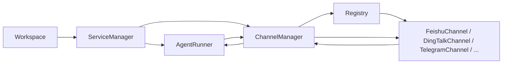
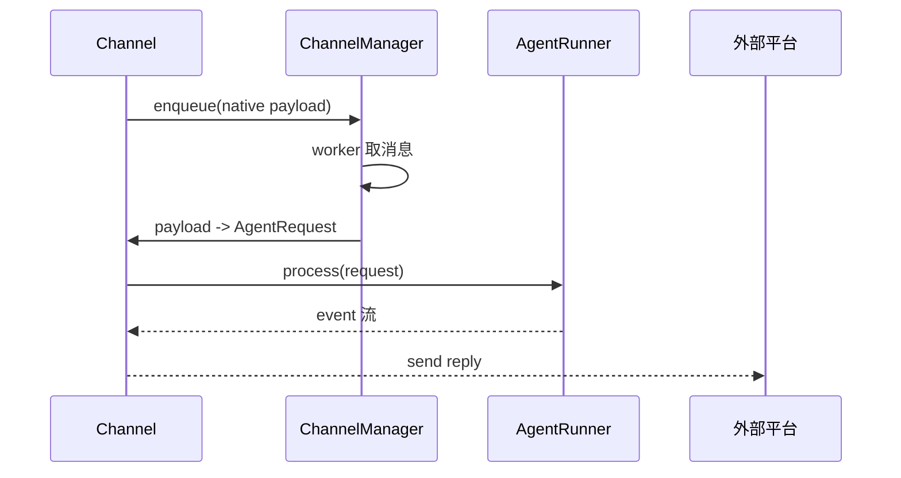

# CoPaw 架构导读：按文件读懂 `registry.py`、`manager.py`、`runner.py`、`workspace.py`

这篇文档不是泛泛地讲“插件架构是什么”，而是**结合 CoPaw 当前项目**，带你按文件理解系统是怎么跑起来的。

目标很明确：

- 看懂 `workspace.py` 在组装什么
- 看懂 `registry.py` 是怎么发现内置 / 外置 channel 的
- 看懂 `manager.py` 是怎么把消息调度给各个 channel 的
- 看懂 `runner.py` 是怎么真正执行 agent 的

看完之后，你应该能回答这几个问题：

- CoPaw 一个 agent runtime 是怎么启动的？
- 飞书/钉钉/Telegram 这些 channel 是怎么被装进系统的？
- 为什么第三方消息不会直接调 agent，而是先过 manager？
- 真正执行业务的地方到底在哪里？

## 1. 先给你一张总图

### 1.1 运行时总结构



### 1.2 一条消息的最短链路



## 2. 推荐阅读顺序

如果你按“文件名字母顺序”读，会很痛苦。

更推荐的顺序是：

1. `workspace.py`
2. `service_factories.py`
3. `channels/registry.py`
4. `channels/manager.py`
5. `runner.py`

虽然你指定的核心文件是四个，但在 CoPaw 里 `workspace.py` 和 `manager.py` 之间有一个关键桥：`service_factories.py`。  
如果不看它，你会知道“channel_manager 存在”，但不知道“它是怎么被创建出来并且接上 runner 的”。

## 3. 先读 `workspace.py`

文件：

```text
src/copaw/app/workspace/workspace.py
```

### 3.1 这个文件的职责

它解决的问题不是“处理消息”，而是：

```text
一个 agent 运行时实例到底由哪些服务组成，以及这些服务怎么启动 / 停止
```

你可以把 `Workspace` 理解成：

```text
一个 agent 的完整运行容器
```

它里面至少有：

- `runner`
- `channel_manager`
- `memory_manager`
- `mcp_manager`
- `chat_manager`
- `cron_manager`

### 3.2 第一遍应该看什么

第一遍只看这几个位置：

- `__init__`
- 各种 `@property`
- `_register_services`
- `start`
- `stop`

不要一上来陷进 `set_reusable_components`、`watcher`、`cron`。

### 3.3 你读这个文件时应该建立的认知

#### `__init__` 在做什么

`Workspace.__init__` 做了三件事：

- 保存 `agent_id` 和 `workspace_dir`
- 创建 `ServiceManager`
- 调 `_register_services()`，登记有哪些服务

所以这里**只是“登记服务”**，还没有真正启动它们。

#### `@property` 在做什么

这些属性：

- `runner`
- `channel_manager`
- `memory_manager`
- `chat_manager`

本质上只是从 `ServiceManager.services` 里拿实例。

也就是说：

```text
Workspace 自己不是直接持有这些对象，而是通过 ServiceManager 间接管理
```

#### `_register_services` 是什么

这是这个文件最重要、也最让人头疼的地方。

它不是在“执行初始化”，而是在**声明一张运行时装配表**：

- 有哪些服务
- 每个服务怎么创建
- 先后顺序是什么
- 启动方法是什么
- 停止方法是什么
- 哪些服务可以复用

第一次读时，你要重点看的是：

- `runner` 的 priority 是 10
- `memory_manager / mcp_manager / chat_manager` 是 priority 20
- `runner_start` 是 priority 25
- `channel_manager` 是 priority 30

这就是 CoPaw 的运行时启动顺序。

#### `start` 在做什么

`Workspace.start()` 非常关键，它大致等价于：

```text
1. 读取 agent 配置
2. 让 ServiceManager 按顺序启动所有服务
```

真正的复杂度并不在 `start()` 里，而在：

- `_register_services()`
- `ServiceManager.start_all()`

### 3.4 读 `workspace.py` 的正确问题

读这个文件时，你不要问：

```text
为什么这段代码写得这么绕？
```

而应该问：

- CoPaw 一个 agent 的运行时边界是什么？
- 哪些服务属于一个 agent 自己？
- 哪些服务是通过 ServiceManager 管理的？
- 启动顺序怎么保证？

### 3.5 第一遍可以先忽略什么

- `TaskTracker`
- `set_reusable_components`
- `agent_config_watcher`
- `mcp_config_watcher`
- `__repr__`

这些对理解主链路不是第一优先级。

## 4. 接着看 `service_factories.py`

文件：

```text
src/copaw/app/workspace/service_factories.py
```

虽然它不在你点名的四个文件里，但它是理解 `workspace -> channel_manager -> runner` 的桥。

### 4.1 为什么它很关键

因为 `_register_services()` 只说：

```text
channel_manager 这个 service 的 post_init 是 create_channel_service
```

那 `create_channel_service()` 到底干了什么？答案就在这个文件。

### 4.2 这一段你要看什么

最关键的是 `create_channel_service()`：

- 它拿到 `workspace` 当前的配置
- 拿到 `runner`
- 调 `make_process_from_runner(runner)`
- 再调用 `ChannelManager.from_config(...)`

这一步非常关键，因为它把：

```text
runner.stream_query
```

注入给了 `ChannelManager`，变成所有 channel 最终调用的 `process(request)`。

### 4.3 一句总结

`service_factories.py` 负责把 `Workspace` 的“声明式 service”变成真正连起来的运行时对象。

## 5. 再读 `registry.py`

文件：

```text
src/copaw/app/channels/registry.py
```

### 5.1 这个文件的职责

它不负责消息收发，也不负责调度，它只负责一件事：

```text
告诉系统：有哪些 channel 类可以被创建
```

### 5.2 第一遍应该看什么

只看这四块：

- `_BUILTIN_SPECS`
- `_load_builtin_channels()`
- `_discover_custom_channels()`
- `get_channel_registry()`

### 5.3 内置 channel 怎么发现

内置 channel 是**写死注册表**，不是扫目录：

```python
"feishu": (".feishu", "FeishuChannel")
```

然后 `_load_builtin_channels()` 会：

1. `importlib.import_module(module_name, package=__package__)`
2. `getattr(mod, class_name)`
3. 检查是不是 `BaseChannel` 子类
4. 放进结果字典

也就是说：

```text
registry 先知道“去哪 import、拿哪个类名”，然后才拿到类对象
```

### 5.4 外置 channel 怎么发现

外置 channel 则走目录扫描：

```text
WORKING_DIR/custom_channels/
```

它支持：

- 单文件模块：`xxx.py`
- 包目录：`xxx/__init__.py`

发现逻辑是：

1. 扫目录
2. 动态 import
3. 遍历模块对象
4. 找 `BaseChannel` 子类
5. 用类上的 `channel` 属性做 key

### 5.5 这个文件读完你应该知道什么

- CoPaw 有哪些内置 channel
- 外置 channel 放哪里
- 内置和外置怎么合并
- 自定义 channel 为什么不需要改核心代码就能被系统发现

### 5.6 第一遍可以忽略什么

- cache 清理函数
- 错误日志细节

先抓主流程就行。

## 6. 再读 `manager.py`

文件：

```text
src/copaw/app/channels/manager.py
```

### 6.1 这个文件的职责

这是整个消息接入层最核心的调度器。

它的职责不是“理解飞书协议”，也不是“执行业务”，而是：

- 持有所有 channel 实例
- 为每个 channel 建队列
- 注入 enqueue 回调
- 起 worker 消费消息
- 确保同 session 串行、不同 session 并行
- 提供主动发送能力

### 6.2 第一遍应该看什么

第一遍推荐顺序：

1. `from_config`
2. `_make_enqueue_cb`
3. `enqueue`
4. `_consume_channel_loop`
5. `start_all`
6. `send_text`

### 6.3 `from_config` 在做什么

这是“实例化所有 channel”的地方。

它会：

1. 调 `get_channel_registry()` 拿到类对象
2. 遍历每个 channel key
3. 看配置里是否启用
4. 调 `ch_cls.from_config(...)`
5. 收集成 `channels` 列表
6. 返回 `ChannelManager(channels)`

所以：

```text
registry 负责发现“类”
manager.from_config 负责把“类”变成“实例”
```

### 6.4 `_make_enqueue_cb` 在做什么

这是非常关键的一步。

它会给每个 channel 生成一个回调：

```python
def cb(payload):
    self.enqueue(channel_id, payload)
```

这意味着 channel 并不自己直接调 worker，也不自己直接调 agent，而是把消息重新投递回 `ChannelManager`。

所以像飞书里你看到的：

```python
self._enqueue(native)
```

实际上就是在调用 `ChannelManager.enqueue(...)`。

### 6.5 `enqueue` 和 `_consume_channel_loop` 是怎么配合的

这里是 manager 最关键的执行链：

```text
channel 收到消息
-> self._enqueue(payload)
-> ChannelManager.enqueue(...)
-> 放进 channel 对应 queue
-> worker await q.get()
-> 取出 payload
-> 合并同 session 消息
-> 调 channel._consume_one_request(...)
```

这解释了为什么第三方消息不会直接调 agent：

```text
因为 CoPaw 先把所有消息统一交给 ChannelManager 调度
```

### 6.6 `start_all` 在做什么

这是 manager 的真正启动入口。

它做三件事：

1. 为每个 channel 建 queue
2. 给每个 channel 注入 `_enqueue` 回调
3. 为每个 channel 起多个 worker task
4. 最后调用每个 channel 自己的 `start()`

这四步非常重要。

可以把它脑内翻译成：

```text
先搭调度系统
-> 再把 channel 接进来
-> 再让 channel 自己建立外部连接
```

### 6.7 `send_text` / `send_event` 是什么

这两个不是入站链路，而是主动发送链路。

用在：

- cron
- heartbeat
- 后台主动推送

它们把：

```text
(channel, user_id, session_id)
```

转成各个 channel 自己能理解的目标地址，然后调用 channel 的发送能力。

### 6.8 第一遍可以先忽略什么

- `replace_channel`
- `stop_all`
- dingtalk 特判日志

第一遍先建立“队列 + worker + channel 实例 + enqueue 回调”这个主模型。

## 7. 最后读 `runner.py`

文件：

```text
src/copaw/app/runner/runner.py
```

### 7.1 这个文件的职责

这是核心业务执行器。

如果说：

- `registry.py` 解决“有哪些插件”
- `manager.py` 解决“消息怎么调度”
- `workspace.py` 解决“运行时怎么组装”

那么 `runner.py` 解决的就是：

```text
拿到统一请求之后，真正怎么执行 agent
```

### 7.2 第一遍应该看什么

第一遍只看：

- `__init__`
- `set_chat_manager`
- `set_mcp_manager`
- `_resolve_pending_approval`
- `query_handler`

### 7.3 为什么重点看 `query_handler`

因为当前仓库里对你最有价值的核心逻辑，都在 `query_handler()`。

虽然 channel 层注入给 manager 的是：

```text
runner.stream_query
```

但在这个仓库里真正值得你读透的执行逻辑，是 `query_handler()` 里的这段流程：

1. 取最后一条用户文本
2. 处理审批逻辑
3. 判断是否进入命令路径
4. 建立 `env_context`
5. 读取 agent 配置
6. 创建 `CoPawAgent`
7. 装载 memory / mcp / chat
8. 加载 session state
9. 执行 `agent(msgs)`
10. 用 `stream_printing_messages(...)` 把 agent 输出流式产出

所以它本质上是：

```text
统一请求 -> 准备上下文 -> 创建 agent -> 执行 agent -> 流式输出结果
```

### 7.4 你要特别注意什么

#### `AgentRunner` 本身不是第三方协议层

这里已经完全不懂飞书、钉钉、Telegram 细节了。

它只关心：

- `session_id`
- `user_id`
- `channel`
- `msgs`

说明这层抽象是干净的。

#### `CoPawAgent` 才是真正的业务 / LLM 执行主体

`AgentRunner` 更多像 orchestration：

- 组装上下文
- 管理 memory
- 管理 session
- 管理 MCP
- 驱动 agent 执行

它本身不是那个“思考的人”，它是那个“把 agent 安排好去工作的人”。

### 7.5 第一遍可以忽略什么

- `_cleanup_denied_session_memory`
- 一些异常 dump 细节
- 很多日志内容

先抓主流程：

```text
query_handler -> 构造 agent -> 执行 agent -> yield 流
```

## 8. 把四个文件串起来

现在把四个文件连成一条链：

### 8.1 启动链

```text
Workspace.start()
-> ServiceManager.start_all()
-> create runner
-> create channel_manager
-> ChannelManager.from_config()
-> get_channel_registry()
-> 实例化 FeishuChannel / DingTalkChannel / ...
-> ChannelManager.start_all()
-> 给每个 channel 注入 _enqueue
-> 启动各个 channel 的外部连接
```

### 8.2 消息链

```text
第三方平台消息
-> Channel 收到原始消息
-> self._enqueue(native)
-> ChannelManager.enqueue(...)
-> worker 取消息
-> channel._consume_one_request(...)
-> process(request)
-> AgentRunner
-> yield event
-> Channel 发回第三方平台
```

## 9. 给你一套“按文件阅读”的实践方法

以后你自己读 CoPaw，可以按这个节奏：

### 第一轮：只看“系统图”

只回答：

- `Workspace` 管什么？
- `ChannelManager` 管什么？
- `AgentRunner` 管什么？
- `Registry` 管什么？

### 第二轮：只追“启动链”

从 `Workspace.start()` 开始，一路追到 `ChannelManager.start_all()`。

### 第三轮：只追“一条消息”

只选飞书或 Telegram 一条消息，不要同时追多个平台。

### 第四轮：最后再看“扩展点”

例如：

- 自定义 channel 怎么发现
- reload 怎么替换 channel
- reusable service 怎么复用

## 10. 每个文件最值得你记住的一句话

### `workspace.py`

```text
它定义“一个 agent runtime 由哪些服务组成，以及这些服务按什么顺序启动”
```

### `registry.py`

```text
它定义“系统能发现哪些 channel 类”
```

### `manager.py`

```text
它负责“把 channel 实例组织起来，并统一调度消息”
```

### `runner.py`

```text
它负责“拿到统一请求后，真正驱动 agent 去执行”
```

## 11. 你现在可以怎么继续往下读

如果你准备继续深入，推荐下一步顺序：

1. `src/copaw/app/channels/base.py`
2. 一个具体 channel，比如 `src/copaw/app/channels/feishu/channel.py`
3. `src/copaw/app/workspace/service_manager.py`

为什么这样排：

- `base.py` 能帮你理解 channel 共性
- 具体 channel 帮你理解外部协议怎么接进来
- `service_manager.py` 帮你理解为什么 `workspace.py` 是声明式的

## 12. 最后的建议

读 CoPaw 这种项目时，最有效的方法不是“从上往下通读”，而是始终围绕下面四个问题：

- 这个对象是谁创建的？
- 它在哪里被注入依赖？
- 它在哪里真正开始执行？
- 它的输出最后流向哪里？

你只要不断用这四个问题去拆文件，复杂度就会变成一张图，而不再是一团线。
