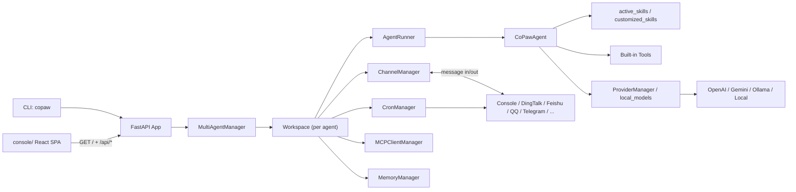
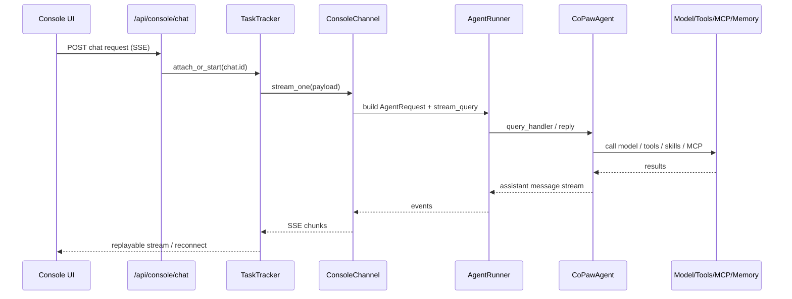
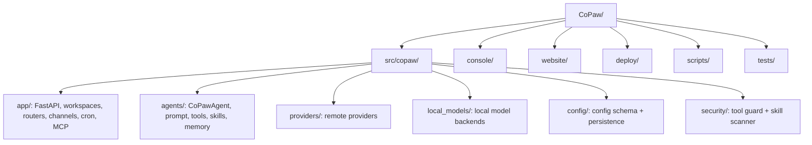
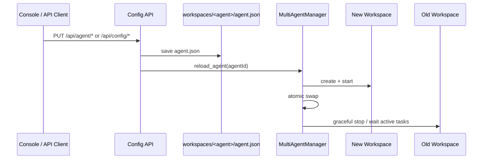

# CoPaw 项目初步理解

本文基于当前仓库 `d:\vibe\CoPaw` 的实际源码、目录结构和配置文件整理，目标是帮助新人快速建立全局认知，而不是一次性吃透全部实现细节。

## 0. 缺失点

- 未提供仓库 URL，本文按当前工作目录的实际源码判断。
- 当前环境没有完整开发依赖：`pytest` 不在 PATH，直接导入 `copaw.cli.main` 也会因为缺少 `shortuuid` 失败；因此本文以源码分析为主，没有做完整启动验证。
- 当前 `git status` 显示 `docs/` 是未跟踪目录，因此本文把其中已有文档当辅助材料，不作为主依据。
- 轻量验证里，`from copaw.__version__ import __version__` 可成功导入，当前源码版本输出为 `0.1.0.post1`。

## 1. 项目是做什么的

- 一句话概括：CoPaw 是一个运行在你自己环境里的 AI 个人助理平台，支持多渠道接入、多 Agent、多技能扩展和定时任务，主形态是“CLI 启动的本地服务 + Web 控制台 + 可选桌面壳”。
- 它主要解决的问题：把模型接入、对话入口、技能/工具、定时任务、记忆、外部消息渠道收拢成一个本地可控的统一系统，而不是多个零散 bot 或脚本。
- 典型场景：浏览器里跟助理聊天、把助理接到钉钉/飞书/QQ/Telegram 等渠道、定时推送摘要/提醒、执行文件与命令类自动化任务。
- 类型判断：它首先是一个应用/平台，不是纯 SDK；但内部明显带有框架化扩展点，尤其是 `skills`、`channels`、`providers`、`MCP`。

依据：

- `README_zh.md`
- `src/copaw/app/channels/registry.py`
- `src/copaw/app/crons/manager.py`
- `src/copaw/agents/skills_manager.py`

## 2. 技术栈与运行方式

- 后端是 Python，核心框架是 FastAPI + Uvicorn，Agent 执行能力依赖 AgentScope / AgentScope Runtime，调度用 APScheduler，浏览器/桌面能力用 Playwright 和 pywebview。
- 前端有两个独立子项目：
  - `console/` 是运行时控制台，React + Vite + Ant Design。
  - `website/` 是文档/官网站点，也用 React + Vite，但不属于主运行链路。
- 最常见启动路径是：

```bash
pip install copaw
copaw init --defaults
copaw app
```

然后浏览器打开 `http://127.0.0.1:8088/`。

- CLI 入口在 `src/copaw/cli/main.py`，真正启动 FastAPI 的是 `src/copaw/cli/app_cmd.py`，初始化逻辑在 `src/copaw/cli/init_cmd.py`。
- 构建/发布形态可以确认有 PyPI wheel、Docker 镜像和桌面包；测试入口是 `python scripts/run_tests.py`。
- 最关键配置不是只有一个文件，而是分层的：
  - 根配置 `config.json`
  - 每个 agent 自己的 `workspaces/<agent>/agent.json`
  - 工作区里的 `HEARTBEAT.md` / prompt markdown
  - secret dir 里的 provider/env/auth 配置
- 本地运行最该留意的环境变量：
  - `COPAW_WORKING_DIR`
  - `COPAW_SECRET_DIR`
  - `COPAW_AUTH_ENABLED`
  - `COPAW_CORS_ORIGINS`
  - `COPAW_OPENAPI_DOCS`
  - `COPAW_ENABLED_CHANNELS` / `COPAW_DISABLED_CHANNELS`
  - `PLAYWRIGHT_CHROMIUM_EXECUTABLE_PATH`

依据：

- `pyproject.toml`
- `src/copaw/app/_app.py`
- `src/copaw/app/runner/runner.py`
- `src/copaw/agents/react_agent.py`
- `deploy/Dockerfile`
- `scripts/run_tests.py`

## 3. 目录结构速览

- `src/copaw/` 是绝对核心；里面再分成：
  - `app/`：服务编排、API、工作区、多 Agent、渠道、定时任务、MCP
  - `agents/`：Agent 组装、prompt、tools、skills、memory
  - `providers/`：模型供应商适配层
  - `config/`：配置模型和持久化
  - `security/`：tool guard / skill scanner
  - `local_models/`：本地模型后端
- `console/` 是给用户操作的控制台，主要页面包括聊天、渠道、会话、定时任务、技能、工具、MCP、模型、环境变量、Agent 管理和安全设置。
- `website/` 是独立文档/官网站点；后端主服务只负责 `console` 静态资源，不负责 `website`。
- `deploy/` 放 Docker 运行镜像和入口脚本。
- `scripts/` 放安装、打包、测试、构建辅助脚本。
- `tests/` 分 `unit` 和 `integrated`。

目录协作关系大致是：

- `console/` 调 `/api/*` -> `src/copaw/app/routers/*` -> `Workspace/Runner/Agent`
- `channels/` 是外部平台入口
- `providers/` 和 `local_models/` 给 Agent 提供模型
- `config/` / `envs/` / `security/` 负责控制面

## 4. 核心运行流程

- 启动链路很清楚：`copaw` CLI 入口在 `src/copaw/cli/main.py`，`copaw app` 会调用 Uvicorn 启动 `src/copaw/app/_app.py`。
- App 启动时会先加载持久化环境变量、自动注册认证用户、做单 Agent -> 多 Agent 迁移、确保默认 agent 存在，然后初始化 `MultiAgentManager` 并预启动所有已配置 agent。
- 每个 agent 被包在一个 `Workspace` 里；`Workspace.start()` 会按顺序装配：
  - `runner`
  - `memory_manager`
  - `mcp_manager`
  - `chat_manager`
  - `channel_manager`
  - `cron_manager`
  - 配置 watcher
- Web 控制台的主链路不是直接走通用 `/api/agent`，而是走自定义的 `/api/console/chat` SSE：
  - 前端发请求
  - 后端 `TaskTracker` 建立或复用运行任务
  - `ConsoleChannel.stream_one()` 组装 `AgentRequest`
  - `AgentRunner.query_handler()`
  - `CoPawAgent.reply()`
  - 模型/工具/技能/MCP 执行
  - SSE 回前端
- 多 Agent 的请求路由靠两种方式：
  - `/api/agents/{agentId}/...` 路径
  - 前端在请求头里带 `X-Agent-Id`
- 会话数据是分裂存储的：
  - `ChatManager` 只管 `chats.json` 里的 chat 元信息
  - 真正的对话记忆来自 `sessions/` 里的 session state

## 5. 核心模块拆解

### 5.1 `src/copaw/app/`

后端骨架层，负责 FastAPI、路由、工作区、多 Agent 生命周期、Cron、MCP、Console SSE。更偏基础设施与系统编排。

### 5.2 `src/copaw/app/runner/`

执行层，负责请求进入后的会话恢复、命令分流、Agent 调用、SSE 流、任务跟踪和聊天元数据；它是业务执行入口。

### 5.3 `src/copaw/agents/`

最接近“助理本体”的模块，`CoPawAgent` 在这里把 system prompt、内置工具、技能、MCP、memory、tool guard 串起来；这是最接近业务逻辑的一层。

### 5.4 `src/copaw/app/channels/`

渠道适配层，抽象了 console / 钉钉 / 飞书 / QQ / Telegram / Matrix 等输入输出，统一走 `BaseChannel` + `ChannelManager` 模式，还支持 `custom_channels`。

### 5.5 `src/copaw/providers/` + `src/copaw/local_models/`

模型抽象层，屏蔽 OpenAI / Gemini / Ollama / Anthropic / 本地 llama.cpp / MLX 的差异，并把 provider 配置持久化到 secret dir。

### 5.6 `src/copaw/config/` + `src/copaw/envs/`

控制面配置层。这里定义了根配置、per-agent 配置、迁移逻辑、工作区路径、envs.json 注入等。

### 5.7 `src/copaw/security/`

安全拦截层，包括工具调用前的 `tool_guard` 和技能导入前的 `skill_scanner`。

## 6. 我作为新接手的人，优先该看什么

建议阅读顺序：

1. `README_zh.md`
   为什么先看：先建立产品认知、启动方式和官方推荐使用姿势。
2. `pyproject.toml`
   为什么先看：看语言栈、入口脚本、依赖边界、可选依赖。
3. `src/copaw/app/_app.py`
   为什么先看：看整个系统怎么被装起来，包括 API、console 静态资源、多 Agent 启动。
4. `src/copaw/app/workspace/workspace.py`
   为什么先看：看一个 agent runtime 到底由哪些服务组成。
5. `src/copaw/app/runner/runner.py`
   为什么先看：看请求进入后如何走到 Agent。
6. `src/copaw/agents/react_agent.py`
   为什么先看：看 Agent 如何把 prompt、工具、技能、memory、MCP 组装在一起。
7. `src/copaw/app/routers/console.py`
   为什么先看：如果你关心真实用户主链路，这里就是控制台聊天入口。

如果目标是“快速跑起来”，优先再补：

- `src/copaw/cli/init_cmd.py`
- `src/copaw/cli/app_cmd.py`
- `deploy/Dockerfile`

如果目标是“准备二次开发”，优先再补：

- `src/copaw/app/channels/`
- `src/copaw/providers/`
- `src/copaw/app/routers/config.py`

## 7. 设计特点与架构判断

- 这是很明显的多工作区、多运行时实例架构：`MultiAgentManager -> Workspace -> ServiceManager -> 各服务`。
- 它大量使用适配器/插件机制：
  - channels 可内置也可自定义
  - skills 走目录式注册
  - providers 可内置也可自定义
  - MCP client 可热替换
- 配置是分层的：
  - root config 负责 agent 引用和全局偏好
  - workspace `agent.json` 负责 agent 详细配置
  - secret dir 负责 provider/env/auth
- 有明显的热更新和零停机重载设计：更新 agent 配置后会保存文件，再异步 `reload_agent()`，新 workspace 先启动，再原子替换，旧实例等活跃任务结束后回收。
- 对新人理解成本最大的，不是 Python 语法，而是“主逻辑被拆在本仓库 + AgentScope / AgentScope Runtime 外部库”这件事。

## 8. 潜在难点与风险

- 最大的理解坑是状态分散：
  - `chats.json` 只是 chat 元信息
  - 真正消息记忆在 `sessions/`
  - agent 行为又部分来自工作区里的 Markdown prompt 文件
- 多 Agent + 热重载 + SSE 重连让调试并发问题不算轻松，尤其是 `TaskTracker`、`reload_agent()`、channel queue/debounce 这些地方。
- 配置模型里有不少兼容旧结构的字段和迁移逻辑，新人第一次看会觉得重复甚至绕。这不是你看错了，而是项目确实在从单 Agent 向多 Agent 演进。
- `security` 是真实拦截链路，不是挂名模块。工具调用可能被 deny / require approval，技能导入也会被扫描，所以“为什么工具没执行”不一定是模型问题。
- 有少量注释/术语存在旧痕迹，比如 `ChatManager` 注释还提到 Redis session，但当前实际用的是 `SafeJSONSession`。读注释时要以代码为准。
- 当前工作区里的 `docs/` 不是 Git 跟踪内容，因此即使其中已有文档写得不错，也建议优先信 `src/` 和配置文件。

## 9. 图表辅助理解

### 图 1：项目整体架构图



怎么看：

- 最该记住的是中间主干：`MultiAgentManager -> Workspace -> Runner/Channel/Cron/MCP/Memory -> CoPawAgent`。
- `console/` 是运行时 UI，`website/` 没画进去，因为它是独立文档站，不在主运行链路里。
- `CoPawAgent` 并不直接感知渠道；渠道和模型都被适配层包住了。
- 你二次开发时，先判断你要改的是编排层、Agent 层、渠道层还是模型层。

### 图 2：核心执行流程图



怎么看：

- 控制台主链路不是“前端直接调模型”，而是走 `/api/console/chat`，由后端统一管理任务和 SSE。
- `TaskTracker` 负责运行中会话的复连、停止和多订阅者广播。
- `ConsoleChannel` 不只是输出打印，它还负责把 console payload 转成统一的 `AgentRequest`。
- 如果你调试“前端为什么没收到消息”，优先查 `console.py`、`task_tracker.py`、`console/channel.py`。

### 图 3：目录与模块映射图



怎么看：

- 不要把 `console/` 和 `website/` 混为一谈；前者是产品 UI，后者是文档站。
- 真正的系统运行逻辑几乎都在 `src/copaw/` 里。
- 如果你要做后端功能，首看 `app/` 和 `agents/`；如果你要改模型接入，看 `providers/`；如果你要改安全或权限，看 `security/`。
- `tests/` 的结构也跟这个脑图一致，能反向帮你定位重点模块。

### 图 4：配置更新与热重载图



怎么看：

- 这个项目不是“改配置就必须重启整个进程”的思路，而是尽量做 agent 级热重载。
- `reload_agent()` 会先拉起新实例，再替换旧实例，所以它是偏零停机的。
- 另外还有 `AgentConfigWatcher` / `MCPConfigWatcher` 轮询文件变化做自动应用，所以有些改动即使不是从 UI 发起，也可能生效。
- 调试“配置改了为什么没马上生效”时，要分清是 API 触发 reload、watcher 触发，还是你改错了 root config / agent.json。

## 10. 初版认知总结

- 它不是一个简单聊天机器人，而是一个本地可部署的 AI 助理运行平台。
- 主骨架记成一句话就够了：`多 Agent 管理器 -> 每个 Agent 一个 Workspace -> Runner/Channel/Cron/MCP/Memory -> CoPawAgent`。
- Web 控制台是主用户入口，但它只是一个前端壳；核心逻辑都在 Python 后端。
- 每个 agent 都有独立工作区和独立 `agent.json`，这比“一个全局 bot 配置”更重，也更灵活。
- Prompt 不是只写在 Python 里，很多行为来自工作区里的 Markdown 文件。
- Skills 是目录式扩展，不是写死在代码里的插件注册表。
- 渠道、模型、MCP 都做了适配层，所以项目很适合扩展，但阅读时要先认清分层。
- 会话元数据和会话内容是分开存的，读聊天相关代码时要分清 `chats.json` 和 `sessions/`。
- 安全模块是真正参与执行链路的，尤其是工具审批流。
- 如果你读着读着觉得“怎么有些关键逻辑不在仓库里”，这是正常的，因为部分底层能力来自 AgentScope / AgentScope Runtime。

## 11. 下一步阅读计划

### 30 分钟内

先看：

- `README_zh.md`
- `pyproject.toml`
- `src/copaw/app/_app.py`

目标：

- 搞清产品定位、启动方式、服务组成、前后端关系。

预期收获：

- 你会知道“这不是网站仓库，而是 Python 后端主导的多 Agent 平台”。

### 2 小时内

再看：

- `src/copaw/app/workspace/workspace.py`
- `src/copaw/app/runner/runner.py`
- `src/copaw/agents/react_agent.py`
- `src/copaw/app/routers/console.py`

目标：

- 串清“从请求进来到 Agent 执行再到结果流出”的主链路。

预期收获：

- 你会真正知道该从哪里打断点。

### 1 天内

补看：

- `src/copaw/app/channels/`
- `src/copaw/providers/`
- `src/copaw/config/config.py`
- `src/copaw/security/`
- `console/src/pages/Chat/index.tsx`

目标：

- 弄清扩展点、配置层、前端调用方式和安全拦截。

预期收获：

- 你就能开始判断“我要改渠道、模型、工具、UI 还是配置层”。
