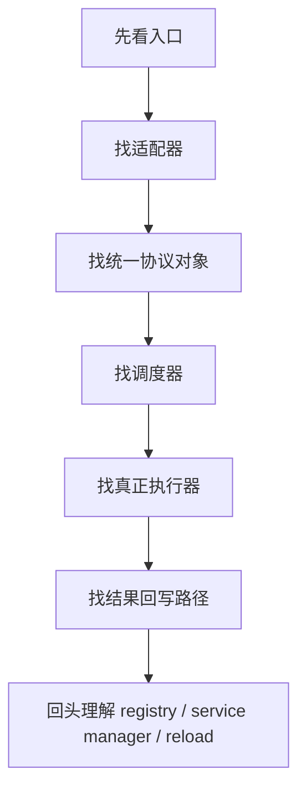

# 如何阅读插件化运行时 / 事件驱动 / 异步调度类源码

这篇教程不是教你“这类架构是什么”，而是教你：

```text
当你第一次打开这种源码时，应该怎么读，怎么追调用链，怎么不迷路。
```

如果你以前更熟悉的是：

- Web API
- CRUD 业务
- controller / service / repo

那你第一次看这类代码时常见的感受会是：

- “函数怎么不直接调函数了？”
- “为什么全是注册、注入、回调？”
- “消息到底是从哪来的？”
- “这段代码明明写在这里，为什么不是从这里开始执行？”

这都是正常现象。

这类源码难的地方，不是算法，也不是语法，而是：

- 执行路径不直线
- 代码会跨很多文件才跑完整
- 既有同步思维，也有异步思维，还有事件驱动思维

这篇教程会给你一套可重复使用的阅读方法。

## 1. 先知道你在面对什么

你现在面对的不是“普通业务代码”，而是偏运行时 / 基础设施化业务的代码。

常见特征：

- 有 `Registry`
- 有 `Manager`
- 有 `start / stop / reload`
- 有 `callback`
- 有 `async for`
- 有 `queue + worker`
- 有“中间协议对象”，比如 `Request` / `Event`

这意味着：

```text
你不能再用“从 controller 一路向下读”的方式去理解它。
```

你需要改成：

```text
先找入口 -> 再找调度 -> 再找真正执行点 -> 最后找回写路径
```

## 2. 阅读这种源码时最重要的四个问题

第一次看时，不要试图全部搞懂。

先只回答这四个问题：

1. 消息 / 请求从哪来？
2. 它先被谁接住？
3. 谁真正执行核心业务？
4. 结果最后从哪里发出去？

如果这四个问题你能回答出来，整套系统就已经不再是黑箱。

以当前项目为例，这四个问题的答案是：

```text
1. 消息从飞书 WebSocket / Telegram handler / 其他渠道回调来
2. 先被 Channel 接住
3. 真正执行业务的是 AgentRunner
4. 结果由 Channel 再发回第三方平台
```

这就是你的第一层地图。

## 3. 阅读顺序：永远先看“链路”，别先看“类定义”

很多人一上来就打开一个 2000 行的大文件，从上往下读。

这通常是最痛苦的方式。

更好的顺序是：

### 第一步：先找系统入口

你先问：

- 这个程序启动从哪开始？
- HTTP 入口在哪？
- WebSocket 回调在哪？
- 谁创建了运行时对象？

在当前项目中，推荐先看：

- `src/copaw/app/_app.py`
- `src/copaw/app/workspace/workspace.py`
- `src/copaw/app/workspace/service_manager.py`

### 第二步：只追一条最短链路

不要同时看飞书、钉钉、Telegram。

只选一个渠道，例如飞书，然后只追这一条：

```text
飞书来消息
-> 谁收到
-> 谁入队
-> 谁转成内部 request
-> 谁执行 agent
-> 谁发送回复
```

### 第三步：再抽象共性

等你看完飞书后，再问：

- 这是不是所有 channel 共用的模式？
- 哪些代码是 Feishu 特有？
- 哪些代码是 BaseChannel 抽象？

### 第四步：最后再回来看框架层

例如：

- registry 是怎么发现插件的
- service manager 是怎么启动组件的
- reload 是怎么做的

如果你一开始就钻这些，很容易陷进去。

## 4. 阅读这类代码的推荐地图

建议你始终按这个顺序读：

```text
入口
-> 适配器
-> 调度器
-> 执行器
-> 回写器
```

在当前项目里可以翻译成：

```text
_app.py / router
-> FeishuChannel
-> ChannelManager
-> AgentRunner
-> FeishuChannel.send_content_parts
```

## 5. 你最需要追的不是“类”，而是“对象流”

这类代码最关键的不是“某个类有多少方法”，而是：

```text
一个对象是怎么变形的
```

例如在当前项目里：

```text
飞书原始 payload
-> native dict
-> AgentRequest
-> Event 流
-> 飞书文本 / 图片 / 文件发送请求
```

所以阅读时，优先追这些对象：

- `native payload`
- `AgentRequest`
- `Event`
- `to_handle`
- `meta`

只要这些对象的来龙去脉你弄清了，函数就不再神秘。

## 6. 一套通用的“追链路”方法

下面是最实用的方法。

### 6.1 从“被调用”的地方往回找

如果你看到这行代码：

```python
async for event in self._process(request):
```

不要先问 “这里干了什么”，而是先问：

- `request` 从哪来的？
- `self._process` 在哪赋值？
- 这个函数是谁调用到这里的？

这三个问题一回答，链路就会自然展开。

### 6.2 看“赋值点”，不要只看“定义点”

很多关键逻辑不是在定义时连接起来的，而是在运行时注入的。

例如：

- `self._enqueue`
- `self._process`
- `channel_manager`

你必须找“它在哪里被赋值”，而不只是“它在哪里声明”。

这类关键词要重点搜：

```text
set_
from_config
from_env
post_init
start_all
create_task
enqueue
register
```

### 6.3 先看“谁创建它”，再看“谁调用它”

对一个对象，阅读顺序通常应该是：

1. 它在哪被创建？
2. 创建时注入了什么？
3. 它的生命周期由谁管？
4. 谁在运行时调用它？

比如 `FeishuChannel`：

- 谁实例化它？`ChannelManager.from_config`
- 谁给它注入 `_enqueue`？`ChannelManager.start_all`
- 谁调用它的 `start()`？`ChannelManager.start_all`
- 谁调用它的 `_run_process_loop()`？`BaseChannel._consume_one_request`

## 7. 你要习惯区分三种代码

这类项目里，经常把三种代码混在一起：

### 7.1 声明代码

例如：

- 注册表
- `ServiceDescriptor`
- 配置字段
- `channel = "feishu"`

这类代码不是马上执行的，而是在告诉系统“未来怎么运行”。

### 7.2 装配代码

例如：

- `from_config`
- `set_enqueue`
- `create_channel_service`
- `start_all`

这类代码负责“把零件组起来”。

### 7.3 真正执行代码

例如：

- `_on_message`
- `_consume_one_request`
- `runner.stream_query`
- `send_content_parts`

阅读时如果把这三类混在一起，就会非常乱。

正确方式是：

```text
先确认声明
-> 再确认装配
-> 最后找执行
```

## 8. 读 async / callback / queue 源码的专项技巧

### 8.1 看到 callback，先问“回调是在哪注册的”

例如：

- WebSocket SDK 的回调
- HTTP handler
- MessageHandler

不要先盯回调函数本身，先找：

```text
register_xxx(...)
add_handler(...)
EventDispatcherHandler.builder(...)
```

### 8.2 看到 queue，先问“谁 put，谁 get”

只要一个项目里出现 queue，你就先找：

- `put_nowait`
- `put`
- `enqueue`
- `get`
- `q.get()`

这通常一下就能把“生产者”和“消费者”分开。

### 8.3 看到 async for，先问“它在消费谁的流”

例如：

```python
async for event in self._process(request):
```

这种代码一定要追：

- `_process` 是什么
- 它返回的是谁的 async generator
- 生成器的源头是哪个执行器

### 8.4 看到 create_task，先问“后台任务谁负责收尾”

例如：

- worker loop
- delayed cleanup
- debounce timer

每次看到 `asyncio.create_task(...)`，你都要问：

- 谁保存 task 引用？
- 什么时候 cancel？
- 会不会泄漏？

这是阅读这类源码时非常关键的一步。

## 9. 实战阅读模板：拿到一个陌生类怎么拆

比如你打开 `FeishuChannel`，推荐按下面顺序看：

### 第一层：类的职责

先只看：

- 类注释
- `channel = "feishu"`
- `__init__`
- `start`
- `stop`

回答：

```text
这个类是“干什么的”？
它是收消息的，还是发消息的，还是都做？
```

### 第二层：入站逻辑

重点看：

- `_on_message_sync`
- `_on_message`
- `build_agent_request_from_native`

回答：

```text
飞书消息进来后，它变成了什么？
```

### 第三层：出站逻辑

重点看：

- `_run_process_loop`
- `send_content_parts`
- `_send_text`
- `_send_file`

回答：

```text
agent 的输出是怎么发回飞书的？
```

### 第四层：状态与路由

重点看：

- `session_id`
- `meta`
- `receive_id`
- `to_handle`

回答：

```text
系统为什么知道应该回给谁？
```

## 10. 一张通用阅读图



你应该始终按这个顺序，而不是上来就看 `Registry` 和 `ServiceManager`。

## 11. 如何知道自己“已经看懂了”

当你能独立回答下面这些问题时，基本就算看懂一条链路了：

- 一条飞书消息从哪进入？
- 什么时候从第三方格式变成内部格式？
- 哪一层真正调用 agent？
- agent 的消息从哪产出？
- 谁把结果发回飞书？
- 为什么回复不会跑错会话？
- 哪一层负责并发 / 串行？

如果你只能说“这里有个 manager”，还不算看懂。

如果你能说：

```text
飞书 WS 回调 -> FeishuChannel._on_message -> _enqueue(native)
-> ChannelManager worker -> _consume_one_request
-> payload -> AgentRequest -> runner.stream_query
-> async for event -> send_content_parts -> 飞书 OpenAPI
```

那就已经真正看懂了。

## 12. 阅读时最常见的误区

### 12.1 想一次看懂全局

这会非常痛苦。

正确做法：

- 一次只看一条链
- 一次只看一个插件
- 一次只回答一个问题

### 12.2 只看定义，不看连接点

这种项目里最关键的不是“函数在哪里定义”，而是：

```text
它在哪里被注册
它在哪里被注入
它在哪里被调用
```

### 12.3 把所有层混在一起看

比如把：

- registry
- channel
- manager
- runner

同时打开。

这会让你的工作记忆爆掉。

### 12.4 忽略对象转换

这类系统里最重要的往往不是函数本身，而是对象在变：

```text
第三方消息 -> native -> Request -> Event -> 第三方回复
```

## 13. 给自己的实际操作清单

以后你再看这类源码，可以直接照这个 checklist：

### 第一步：定入口

- 程序启动入口是哪个文件？
- 外部消息入口是哪个函数？

### 第二步：定执行器

- 核心业务是谁执行？
- 是 `Runner`、`Engine`、`Worker` 还是别的类？

### 第三步：定中间协议

- 系统内部统一 request 是什么？
- 系统内部统一 event / response 是什么？

### 第四步：定调度器

- 有没有 queue？
- 谁 enqueue？
- 谁 dequeue？
- 是否同 session 串行？

### 第五步：定回写链路

- 结果从哪里发出去？
- 发回哪个平台？
- 根据什么路由？

### 第六步：最后再看容器与插件

- registry 怎么发现类？
- service manager 怎么启动服务？
- reload 怎么切换实例？

## 14. 一个很重要的判断标准

你不是要把所有函数背下来。

你真正需要建立的是：

```text
系统地图
```

所谓“看懂”，不是“我记得每一行代码”，而是：

- 我知道入口在哪
- 我知道对象怎么流
- 我知道核心执行点在哪
- 我知道哪层负责哪件事

一旦这张地图建立起来，这类源码就不再可怕。

## 15. 推荐你在当前项目里怎么练

可以按这个顺序练：

1. 只看飞书链路
2. 只看 `FeishuChannel` 的入站和出站
3. 看 `ChannelManager` 的 enqueue / worker
4. 看 `BaseChannel._consume_one_request`
5. 看 `AgentRunner.query_handler`
6. 最后看 `ServiceManager`

顺序不要反。

如果你先看 `ServiceManager`，很容易失去方向。

## 16. 最后的建议

阅读这类源码时，不要追求“快”，要追求“准”。

你每次只要成功回答一个问题，比如：

```text
request 是从哪来的？
```

系统就会少一层迷雾。

当你连续把下面这几个问题都答出来时：

- request 从哪来
- event 从哪来
- queue 谁放谁取
- reply 从哪发出

你就已经跨过最难的阶段了。

这类源码真正的门槛，不是智力门槛，而是“没有地图时很容易迷路”。

你的任务不是硬啃，而是先给自己画地图。
