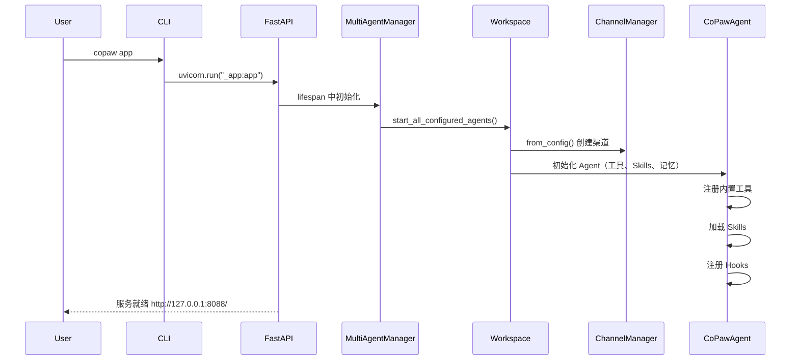
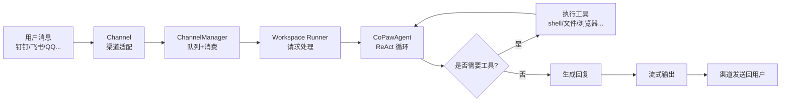
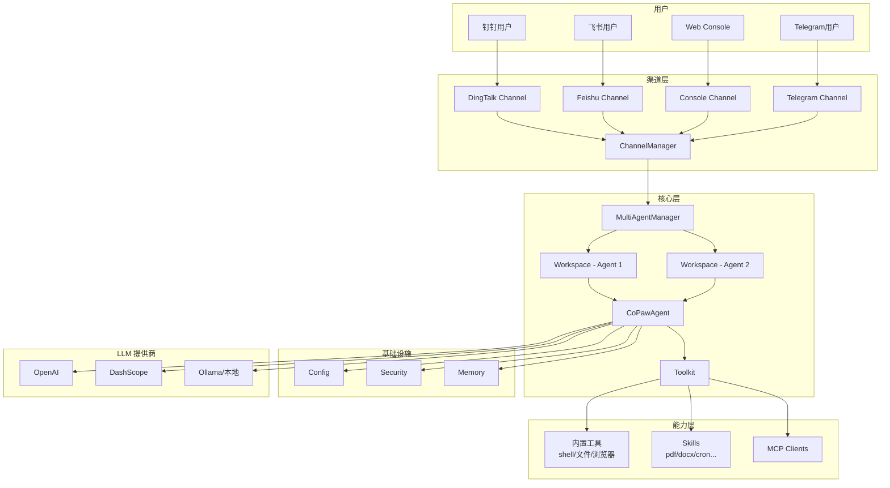
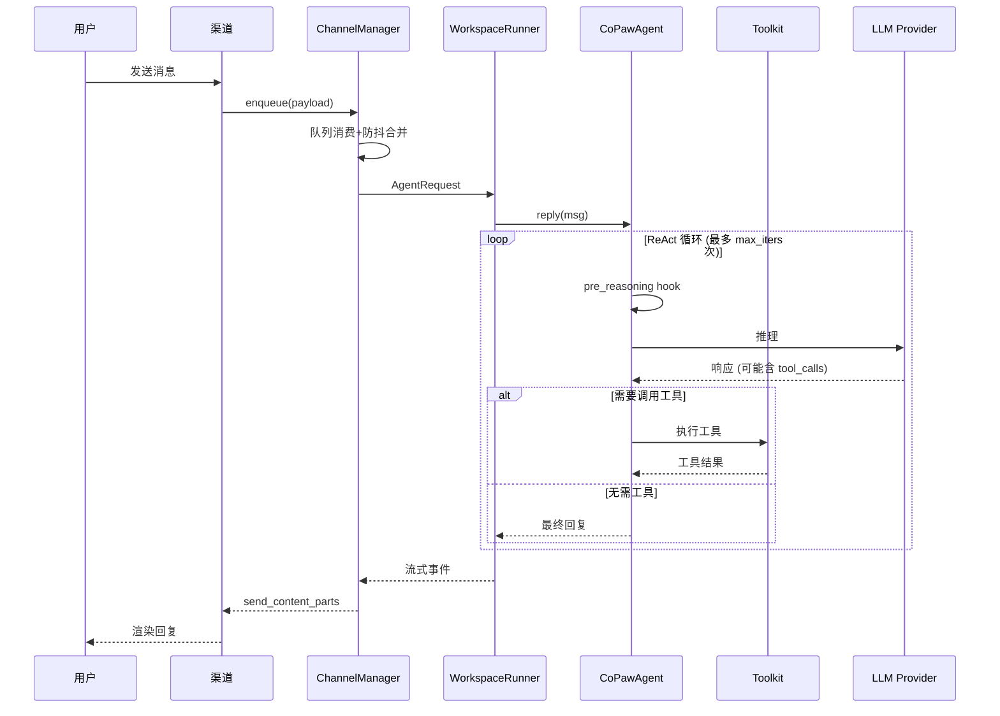
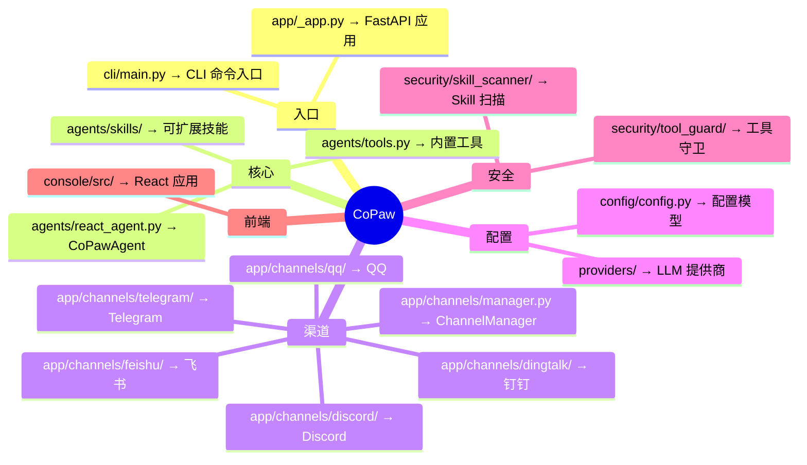
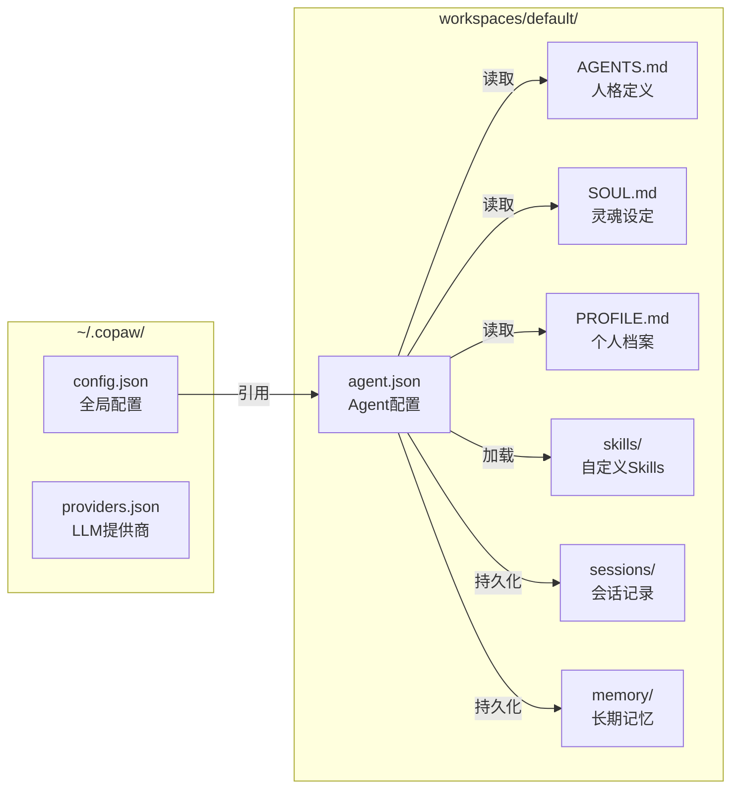

# CoPaw 项目整体认知报告

> 生成时间：2026-03-24
> 目标：帮助新人快速建立对 CoPaw 开源项目的初步理解

---

## 1. 项目是做什么的

**一句话概括**：CoPaw 是一个**可自托管的个人 AI 助手平台**，支持多渠道接入（钉钉、飞书、QQ、Discord、iMessage、Telegram 等），可通过 Skills 扩展能力，数据完全在本地运行。

**主要解决的问题**：
- 统一多渠道接入：一个助手同时接入多个聊天应用
- 数据隐私与自主权：所有数据和配置在本地，无需第三方托管
- 能力可扩展：通过 Skills 机制扩展功能，如文档处理、新闻摘要、定时任务等

**典型使用场景**：
- 个人助理：日程提醒、新闻摘要、知识库管理
- 办公助手：钉钉/飞书机器人，处理文档、邮件摘要
- 开发辅助：代码审查、文件操作、浏览器自动化

**项目类型**：这是一个 **CLI + Web 服务 + 多渠道 Agent 平台**，既是可安装的工具（pip 包），也是可部署的服务（Docker），还提供桌面应用。

---

## 2. 技术栈与运行方式

### 核心技术栈

| 层级 | 技术 |
|------|------|
| **语言** | Python 3.10~3.14, TypeScript (前端) |
| **后端框架** | FastAPI + Uvicorn, AgentScope/AgentScope-Runtime |
| **前端框架** | React 18 + Vite + Ant Design + Zustand |
| **依赖管理** | pip/pyproject.toml (后端), npm (前端) |
| **LLM 接入** | 支持 OpenAI、DashScope、Gemini、Ollama、llama.cpp、MLX 等 |
| **任务调度** | APScheduler |
| **消息队列** | 异步队列（内存） |

### 启动方式

```bash
# 最快启动
pip install copaw
copaw init --defaults
copaw app
# 访问 http://127.0.0.1:8088/
```

### 关键配置文件

| 文件 | 作用 |
|------|------|
| `pyproject.toml` | Python 包定义、依赖、CLI 入口 |
| `config.json` | 主配置文件（渠道、MCP、安全等） |
| `providers.json` | LLM 提供商配置和 API Key |
| `agent.json` | 单个 Agent 的完整配置（在工作空间目录） |
| `.env` | 环境变量（可选） |

### 环境变量关注点

- `DASHSCOPE_API_KEY` / `OPENAI_API_KEY` 等模型 API Key
- `COPAW_WORKING_DIR` - 工作目录（默认 `~/.copaw`）
- `ENABLE_MEMORY_MANAGER` - 是否启用记忆管理

---

## 3. 目录结构速览

```
src/copaw/
├── __init__.py          # 包入口
├── __main__.py          # python -m copaw 入口
├── constant.py          # 全局常量
│
├── cli/                 # CLI 命令实现
│   ├── main.py          # CLI 入口
│   ├── app_cmd.py       # copaw app 启动服务
│   ├── init_cmd.py      # copaw init 初始化
│   ├── skills_cmd.py    # copaw skills 技能管理
│   ├── cron_cmd.py      # copaw cron 定时任务
│   └── ...
│
├── app/                 # Web 应用核心
│   ├── _app.py          # FastAPI 应用入口 ⭐
│   ├── multi_agent_manager.py  # 多 Agent 管理
│   ├── channels/        # 渠道实现 ⭐
│   │   ├── manager.py   # ChannelManager
│   │   ├── base.py      # BaseChannel 基类
│   │   ├── dingtalk/    # 钉钉渠道
│   │   ├── feishu/      # 飞书渠道
│   │   ├── qq/          # QQ 渠道
│   │   ├── discord/     # Discord 渠道
│   │   ├── telegram/    # Telegram 渠道
│   │   └── ...
│   ├── routers/         # API 路由
│   ├── crons/           # 定时任务
│   ├── mcp/             # MCP 客户端管理
│   └── runner/          # Agent 运行器
│
├── agents/              # Agent 核心 ⭐
│   ├── react_agent.py   # CoPawAgent 主实现 ⭐
│   ├── tools.py         # 内置工具（shell、文件、浏览器等）
│   ├── skills_manager.py # Skills 管理
│   ├── prompt.py        # 系统提示构建
│   ├── memory/          # 记忆管理
│   ├── hooks/           # Agent 钩子
│   └── skills/          # 内置 Skills
│       ├── cron/        # 定时任务 skill
│       ├── pdf/         # PDF 处理
│       ├── docx/        # Word 文档
│       ├── xlsx/        # Excel 处理
│       ├── news/        # 新闻摘要
│       └── ...
│
├── config/              # 配置管理
│   ├── config.py        # 配置模型定义 ⭐
│   └── utils.py         # 配置加载/保存
│
├── providers/           # LLM 提供商管理
├── security/            # 安全模块（工具守卫、Skill 扫描）
├── local_models/        # 本地模型支持
├── token_usage/         # Token 统计
└── utils/               # 工具函数

console/                 # 前端 React 应用
├── src/
│   ├── api/             # API 调用
│   └── ...
└── package.json
```

### 目录协作关系

```
用户消息 → Channel(DingTalk/Feishu...) → ChannelManager → Workspace/Runner → CoPawAgent → LLM
                ↑                              ↓
            Console ←───────────────── API Routers
```

---

## 4. 核心运行流程

### 启动流程



### 消息处理流程



### 依据

- CLI 入口：`src/copaw/cli/main.py:62` 定义 `copaw` 命令
- 服务启动：`src/copaw/cli/app_cmd.py:86` 启动 Uvicorn
- FastAPI 应用：`src/copaw/app/_app.py:241` 定义 `app`
- 多 Agent 管理：`src/copaw/app/multi_agent_manager.py:17`
- Agent 核心：`src/copaw/agents/react_agent.py:63` `CoPawAgent`

---

## 5. 核心模块拆解

### 模块总览

| 模块 | 职责 | 层级 |
|------|------|------|
| **CLI (cli/)** | 命令行入口，初始化、启动、管理 | 入口层 |
| **App (_app.py)** | FastAPI 应用，路由注册，生命周期管理 | 框架层 |
| **Channels (channels/)** | 多渠道接入适配 | 接口层 |
| **Agent (react_agent.py)** | 核心 Agent 逻辑，ReAct 循环 | 业务核心 |
| **Tools (tools.py)** | 内置工具（shell、文件、浏览器等） | 能力层 |
| **Skills (skills/)** | 可扩展技能模块 | 能力层 |
| **Config (config.py)** | 配置模型和管理 | 基础设施 |
| **Security (security/)** | 工具守卫、Skill 扫描 | 安全层 |

### 重点模块详解

#### 1. CoPawAgent（核心 Agent）

**文件**：`src/copaw/agents/react_agent.py`

**职责**：
- 继承 `ReActAgent`，实现思考-行动循环
- 管理内置工具注册（shell、文件、浏览器等）
- 动态加载 Skills
- 记忆管理（自动压缩）
- Hook 机制（Bootstrap、MemoryCompaction）

**关键方法**：
- `__init__`: 初始化工具、Skills、模型、记忆
- `reply`: 处理用户消息入口
- `_reasoning`: 推理阶段（含媒体块回退）
- `_acting`: 行动阶段（工具执行）

#### 2. ChannelManager（渠道管理）

**文件**：`src/copaw/app/channels/manager.py`

**职责**：
- 管理所有渠道实例的生命周期
- 异步队列消费，防抖合并消息
- 统一消息入队/出队

**支持的渠道**：
- 钉钉、飞书、QQ、Discord、Telegram
- iMessage、Mattermost、Matrix、MQTT
- 企业微信、小艺、语音

#### 3. MultiAgentManager（多 Agent 管理）

**文件**：`src/copaw/app/multi_agent_manager.py`

**职责**：
- 懒加载 Agent 工作空间
- 多 Agent 隔离与生命周期管理
- 热重载支持

---

## 6. 新人优先阅读顺序

### 如果目标是「快速跑起来」

1. **README.md** - 了解安装和基本使用
2. **pyproject.toml** - 了解依赖和 CLI 入口
3. **src/copaw/cli/app_cmd.py** - 了解服务启动流程
4. **src/copaw/app/_app.py** - 了解应用初始化

### 如果目标是「理解架构/二次开发」

| 顺序 | 文件/目录 | 为什么先看 |
|------|-----------|------------|
| 1 | src/copaw/agents/react_agent.py | 核心 Agent 实现，理解消息处理主线 |
| 2 | src/copaw/app/_app.py | FastAPI 入口，理解服务启动和路由 |
| 3 | src/copaw/app/channels/manager.py | 渠道管理，理解消息入队分发 |
| 4 | src/copaw/config/config.py | 配置模型，理解所有可配置项 |
| 5 | src/copaw/agents/tools.py | 内置工具，理解 Agent 能力边界 |
| 6 | src/copaw/agents/skills/ | Skills 目录，理解如何扩展能力 |
| 7 | console/src/ | 前端源码，理解 Web UI 实现 |

---

## 7. 设计特点与架构判断

### 架构风格

**多层架构 + 插件化设计**：

```
┌─────────────────────────────────────────────────┐
│                   Console (Web UI)               │
├─────────────────────────────────────────────────┤
│                   API Routers                    │
├─────────────────────────────────────────────────┤
│              MultiAgentManager                   │
├─────────────────────────────────────────────────┤
│    Workspace (per-agent)    │    ChannelManager │
│  ┌─────────────────────┐    │                   │
│  │    CoPawAgent       │    │   Channels:       │
│  │  ┌───────────────┐  │    │   - DingTalk     │
│  │  │ Toolkit       │  │    │   - Feishu       │
│  │  │ - Tools       │  │    │   - QQ           │
│  │  │ - Skills      │  │    │   - Discord      │
│  │  │ - MCP         │  │    │   - ...          │
│  │  └───────────────┘  │    │                   │
│  │  Memory │ Hooks     │    │                   │
│  └─────────────────────┘    │                   │
├─────────────────────────────────────────────────┤
│              Config / Security                  │
├─────────────────────────────────────────────────┤
│              LLM Providers                      │
└─────────────────────────────────────────────────┘
```

### 关键设计

| 设计模式 | 体现 |
|----------|------|
| **插件机制** | Skills 可动态加载，渠道可插拔 |
| **Hook 机制** | Agent 支持 pre_reasoning/pre_acting 钩子 |
| **策略模式** | 多 LLM 提供商统一接口 |
| **工厂模式** | `create_model_and_formatter()` 创建模型 |
| **观察者模式** | 配置文件变更监听 |
| **异步队列** | ChannelManager 使用异步队列处理消息 |

---

## 8. 潜在难点与风险

### 新人容易卡住的地方

1. **配置分散**：`config.json`、`providers.json`、`agent.json` 三层配置，关系复杂
2. **渠道配置**：每个渠道需要不同的认证信息，调试困难
3. **Skills 机制**：自动加载目录结构，命名规范需要理解
4. **Hook 执行时机**：Bootstrap、MemoryCompaction 等钩子的触发时机不直观

### 耦合较高的模块

- `CoPawAgent` 与 `Toolkit`、`Memory`、`Hooks` 强耦合
- `ChannelManager` 与所有 `Channel` 实现耦合
- 配置加载与文件系统路径耦合

### 调试困难点

- 多 Agent 架构下，请求路由到哪个 Agent 需要追踪
- 异步队列消费，消息流不易调试
- MCP 客户端连接状态管理复杂

---

## 9. 图表辅助理解

### 图 1：项目整体架构图



**这张图怎么看**：
- 从上到下是请求流：用户 → 渠道 → 管理器 → Agent → 工具/模型
- 左右是并行关系：多个渠道、多个 Agent、多个 LLM
- 记住：**渠道负责接入，Agent 负责处理，Toolkit 负责能力**

---

### 图 2：核心执行流程图



**这张图怎么看**：
- 关注 ReAct 循环：推理 → 工具调用 → 再推理
- 钩子在推理前执行（Bootstrap、MemoryCompaction）
- 流式输出：Agent 产生的每个事件实时推送到渠道

---

### 图 3：目录与模块映射图



**这张图怎么看**：
- 蓝色是入口层，绿色是核心层，橙色是渠道层
- 每个叶子节点是一个目录或关键文件
- 新人建议从 `入口` → `核心` → `渠道` 顺序理解

---

### 图 4：配置层级关系图



**这张图怎么看**：
- `config.json` 是全局入口，通过 `profiles` 引用各个 Agent 工作空间
- 每个 Agent 有独立的 `agent.json` 和 prompt 文件
- Skills 放在 `skills/` 目录，自动加载

---

## 10. 初版认知总结

### 核心要点

1. **定位**：个人 AI 助手平台，支持多渠道、可扩展、自托管
2. **架构**：FastAPI + AgentScope Runtime + 多渠道适配器
3. **核心 Agent**：`CoPawAgent` 基于 `ReActAgent`，实现思考-行动循环
4. **渠道**：13+ 种渠道，统一通过 `ChannelManager` 管理
5. **能力扩展**：内置工具 + Skills + MCP 三层能力体系
6. **配置**：三层配置（全局 → Agent → 运行时）
7. **记忆**：支持长期记忆，自动压缩，基于 ReMe
8. **安全**：工具守卫 + Skill 扫描双重保护
9. **多 Agent**：支持多工作空间隔离，懒加载
10. **前端**：React SPA，通过 API 与后端交互

### 核心抓手

> **渠道接入消息 → ChannelManager 分发 → WorkspaceRunner → CoPawAgent (ReAct 循环 + 工具调用) → 流式输出**

理解这条链路，就抓住了项目的骨架。

---

## 11. 下一步阅读计划

### 30 分钟内

| 目标 | 文件 | 预期收获 |
|------|------|----------|
| 理解 CLI 入口 | cli/main.py | 知道所有命令如何注册 |
| 理解服务启动 | app_cmd.py | 知道服务如何启动 |
| 理解配置结构 | config/config.py (前 200 行) | 知道有哪些配置项 |

### 2 小时内

| 目标 | 文件 | 预期收获 |
|------|------|----------|
| 理解 Agent 核心 | react_agent.py | 理解消息处理流程 |
| 理解渠道机制 | channels/manager.py | 理解消息队列分发 |
| 理解一个渠道 | channels/dingtalk/channel.py | 理解渠道适配模式 |

### 1 天内

| 目标 | 文件/目录 | 预期收获 |
|------|-----------|----------|
| 理解工具体系 | tools.py | 知道 Agent 能做什么 |
| 理解 Skill 机制 | skills/ | 知道如何扩展能力 |
| 理解 API 结构 | routers/ | 知道前端如何与后端交互 |
| 跑通一个完整流程 | 本地启动 + Console 对话 | 验证理解是否正确 |

---

## 附录：快速参考

### 关键文件路径

```
项目入口：
├── src/copaw/__main__.py          # python -m copaw
├── src/copaw/cli/main.py          # copaw CLI 入口
└── src/copaw/app/_app.py          # FastAPI 应用

核心实现：
├── src/copaw/agents/react_agent.py    # CoPawAgent
├── src/copaw/agents/tools.py          # 内置工具
├── src/copaw/app/channels/manager.py  # ChannelManager
└── src/copaw/config/config.py         # 配置模型

配置文件（运行时生成）：
├── ~/.copaw/config.json           # 全局配置
├── ~/.copaw/providers.json        # LLM 提供商
└── ~/.copaw/workspaces/default/   # 默认 Agent 工作空间
    └── agent.json                 # Agent 配置
```

### 常用命令

```bash
copaw init --defaults     # 初始化配置
copaw app                 # 启动服务
copaw app --reload        # 开发模式（热重载）
copaw skills list         # 列出可用 Skills
copaw cron list           # 列出定时任务
copaw --help              # 查看帮助
```

---

*文档结束*