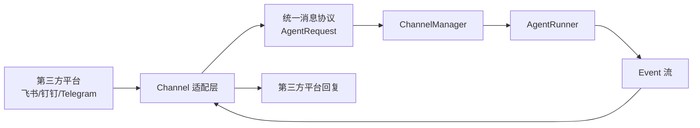
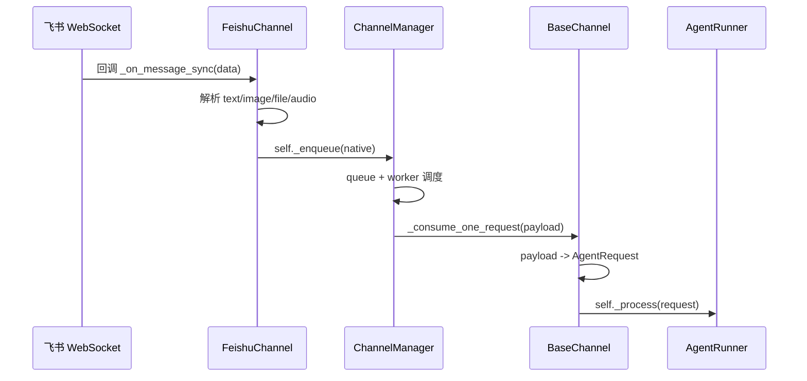
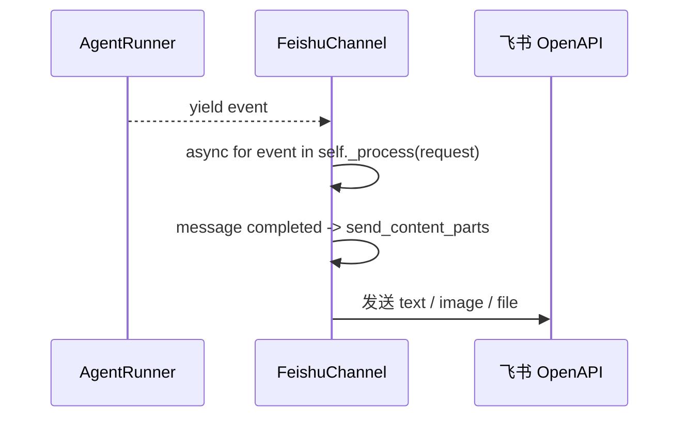

# 插件化运行时与消息驱动架构教程

这篇教程是给第一次接触这类代码的人看的。

如果你看到 `Channel`、`Runner`、`Registry`、`ServiceManager`、`worker loop`、`async for event in ...` 就开始头大，那是正常现象。这类代码本来就不是典型的基础业务代码，而是更偏“运行时 / 基础设施型业务”的写法。

本文会用当前项目的实际结构做例子，解释：

- 这类架构解决什么问题
- 什么时候应该用，什么时候不要用
- 内置插件和外置插件怎么发现、怎么装配
- 一条消息是怎么流过系统的
- 为什么它读起来难
- 如果你要自己设计，应该怎么落地

## 1. 先用一句话理解这类系统

这类系统的核心不是：

```text
请求 -> 一个函数 -> 返回结果
```

而是：

```text
外部系统 -> 适配器 -> 内部统一协议 -> 调度器 -> 执行器 -> 统一事件 -> 适配器回发
```

在当前项目里，大致对应：

```text
飞书 / 钉钉 / Telegram / 企微
-> FeishuChannel / DingTalkChannel / TelegramChannel / WecomChannel
-> AgentRequest
-> ChannelManager
-> AgentRunner
-> Event 流
-> Channel 再把结果发回第三方平台
```

## 2. 为什么普通业务开发会觉得它难

你会觉得难，通常不是因为基础不够，而是因为这里同时叠了很多层模型：

- 面向对象：`Channel`、`Runner`、`Workspace`
- 插件式发现：`registry`
- 容器式初始化：`ServiceManager`
- 事件驱动：WebSocket / callback
- 异步协程：`async` / `await`
- 队列消费：worker loop
- 热更新与生命周期管理：`start` / `stop` / `reload`

而普通 CRUD 项目更常见的是：

```text
controller -> service -> repo -> db
```

所以这类代码最难的地方不在语法，而在“执行路径不直观”。

## 3. 这类架构解决什么问题

### 3.1 多入口，同一套核心业务

如果你要接多个平台：

- 飞书
- 钉钉
- Telegram
- QQ
- Webhook
- MQTT

这些平台的消息协议完全不同，但你希望最终都交给同一套 agent 逻辑处理，那么就需要一层“适配器”把外部协议翻译成统一内部协议。

### 3.2 同会话串行，不同会话并行

聊天系统最常见的问题之一是：

- 同一个会话里的两条消息不能乱序并发处理
- 不同用户 / 不同会话之间又希望并行处理

这就是 `ChannelManager + queue + worker` 这类设计最常见的原因。

### 3.3 长连接、流式输出、生命周期复杂

像飞书、企微、语音、Discord 这类接入，经常会有：

- 长连接
- SDK 回调
- 流式回复
- 独立线程或事件循环
- 重连和停止逻辑

这时就很难继续用“一个 HTTP handler 干到底”的直线思维了。

## 4. 什么时候该用，什么时候别用

### 4.1 适合使用的场景

满足 3 条以上时，可以认真考虑这种方式：

- 你要接多个不同协议的入口
- 它们最终都走同一套核心业务逻辑
- 你需要会话级别的串行处理
- 你需要流式输出或事件流
- 你需要插件化扩展入口
- 你需要热更新、启停、复用组件
- 你已经发现初始化顺序很复杂

### 4.2 不适合使用的场景

下面这些场景通常不值得上这套：

- 只有一个 Web API 入口
- 基本是同步 CRUD
- 没有插件需求
- 没有复杂生命周期
- 团队最优先考虑的是“新人 10 分钟看懂”

一句判断：

```text
问题还没复杂到需要运行时，就不要提前建运行时。
```

## 5. 当前项目的结构图

### 5.1 模块职责图



### 5.2 代码目录地图

```text
src/copaw/app/
  channels/
    base.py
    registry.py
    manager.py
    feishu/
      __init__.py
      channel.py
    dingtalk/
      channel.py
    telegram/
      channel.py
  runner/
    runner.py
  workspace/
    workspace.py
    service_manager.py
    service_factories.py
  _app.py
```

### 5.3 每层职责

| 层 | 作用 | 不该做什么 |
| --- | --- | --- |
| `Channel` | 翻译第三方协议，发送/接收消息 | 不要写核心业务 |
| `ChannelManager` | 排队、并发、同 session 串行 | 不要理解飞书细节 |
| `Runner` | 执行 agent / 核心业务 | 不要知道飞书 API 长什么样 |
| `Workspace` | 组装运行时实例 | 不要承载具体业务 |
| `Registry` | 发现并注册插件 | 不要做实例生命周期 |

## 6. 内置插件和外置插件是怎么工作的

### 6.1 内置插件

内置插件不是扫目录自动发现的，而是显式注册的：

```text
registry 里写死：
"feishu": (".feishu", "FeishuChannel")
```

优点：

- 可控
- 启动稳定
- 出错更容易排查
- 更适合作为官方支持能力

缺点：

- 每加一个内置插件都要改注册表

### 6.2 外置插件

外置插件通常通过扫描目录发现，例如：

```text
custom_channels/
  my_channel.py
  another_channel/
    __init__.py
```

扫描逻辑大致是：

```text
扫 custom_channels/
-> import 模块
-> 遍历模块中的对象
-> 找 BaseChannel 子类
-> 用类上的 channel 属性做注册 key
```

优点：

- 灵活
- 用户可扩展
- 不必改核心代码

缺点：

- 依赖问题更难控
- 兼容性风险更高
- 安全边界更模糊

### 6.3 内置与外置如何搭配

最常见的推荐做法是：

- 核心渠道能力：内置
- 个性化 / 边缘渠道：外置

不要把所有东西都做成外置插件，否则稳定性和可维护性会很快下降。

## 7. 一条飞书消息是怎么跑完整个系统的

### 7.1 入站时序图



### 7.2 出站时序图



### 7.3 为什么要先 enqueue，再 process

很多人第一次看会疑惑：

```text
为什么收到飞书消息后不直接调 agent？
为什么还要先 _enqueue，再 _process？
```

因为这两步职责不同：

- `_enqueue(native)`：把消息投递进统一调度系统
- `self._process(request)`：真正执行 agent

中间隔一个 `ChannelManager`，是为了：

- 同会话串行
- 不同会话并行
- 消息合并与缓冲
- 线程切换安全
- 统一调度多个渠道

## 8. 为什么要有 ServiceManager，不直接初始化不行吗

这也是最容易让人头疼的一层。

直觉上更容易看懂的写法通常是：

```python
self.runner = AgentRunner(...)
self.memory_manager = MemoryManager(...)
self.channel_manager = ChannelManager(...)
await self.channel_manager.start_all()
```

而现在项目里更像是：

```text
先 register service descriptor
-> 再由 ServiceManager.start_all()
-> 按 priority 分组启动
-> 按 service 的 start_method 调度
```

这样做的原因一般有：

- 统一生命周期
- 控制初始化顺序
- 支持并发初始化
- 支持组件复用
- 支持热更新
- 支持条件创建

这在运行时层是合理的，但会显著提升阅读门槛。

所以一个很重要的设计原则是：

```text
只有当初始化顺序和生命周期真的复杂了，再上 ServiceManager。
```

## 9. 自己设计时的推荐步骤

### 步骤 1：先定义统一内部协议

先不要急着写插件。

你应该先想清楚：

- 系统内部统一吃什么请求对象
- 系统内部统一产出什么事件对象

例如：

```python
class AppRequest:
    session_id: str
    user_id: str
    content_parts: list

class AppEvent:
    kind: str
    payload: dict
```

一旦内部协议稳定了，外部插件只负责翻译，不会污染核心逻辑。

### 步骤 2：把外部协议隔离在适配器层

例如：

- `FeishuChannel` 只负责飞书消息的解析与发送
- `TelegramChannel` 只负责 Telegram 消息的解析与发送

不要让业务层知道飞书的 `open_id`、`chat_id`、签名算法这些细节。

### 步骤 3：再决定是否需要 manager / queue

不是所有系统都需要 manager。

你需要判断：

- 有没有多来源入口
- 是否需要同 session 串行
- 是否存在长耗时任务
- 是否需要 backpressure

如果都没有，直接调用更简单。

### 步骤 4：最后再考虑生命周期容器

只有当你开始出现这些情况时，才值得加 `ServiceManager`：

- 组件越来越多
- 初始化顺序有依赖
- 需要统一 start / stop
- 需要热更新或重建
- 需要复用部分服务

## 10. 最小可行骨架

下面是一个简化版骨架，帮助你从零设计时抓住核心。

```python
class BaseChannel:
    channel: str

    def __init__(self, process):
        self._process = process
        self._enqueue = None

    def set_enqueue(self, cb):
        self._enqueue = cb

    async def on_incoming_native(self, native):
        if self._enqueue:
            self._enqueue(native)

    def build_request_from_native(self, native):
        raise NotImplementedError

    async def consume_one(self, payload):
        request = self.build_request_from_native(payload)
        async for event in self._process(request):
            await self.send_event(event)

    async def send_event(self, event):
        raise NotImplementedError


class ChannelManager:
    def __init__(self, channels):
        self.channels = channels
        self.queues = {}

    async def start_all(self):
        for ch in self.channels:
            self.queues[ch.channel] = asyncio.Queue()
            ch.set_enqueue(lambda payload, c=ch.channel: self.enqueue(c, payload))
            asyncio.create_task(self._worker(ch.channel))

    def enqueue(self, channel_id, payload):
        self.queues[channel_id].put_nowait(payload)

    async def _worker(self, channel_id):
        while True:
            payload = await self.queues[channel_id].get()
            ch = next(c for c in self.channels if c.channel == channel_id)
            await ch.consume_one(payload)


class Runner:
    async def stream_query(self, request):
        yield {"kind": "message", "text": "hello"}
```

这个骨架已经包含了这类系统最本质的 3 层：

- `Channel`
- `Manager`
- `Runner`

## 11. 常见反模式

### 11.1 抽象过早

只有一个入口，却先设计 registry / manager / plugin 系统。

结果：

- 阅读成本高
- 修改成本高
- 实际收益很低

### 11.2 适配器层写业务

例如在 `FeishuChannel` 里直接写大量业务判断。

结果：

- 每个渠道一份业务分支
- 测试变复杂
- 核心逻辑难复用

### 11.3 Manager 知道太多接入细节

如果 `ChannelManager` 开始理解飞书特有字段、钉钉 webhook 结构，说明边界已经开始脏了。

### 11.4 只做队列，不做上限

如果：

- queue 有上限
- 但 pending 没上限
- 或失败没有降级策略

那么系统在高负载下会很脆弱。

### 11.5 热更新没有处理双连接窗口

如果新旧实例同时连着同一个外部平台，就可能发生：

- 重复消费
- 重复回复
- SDK 连接冲突

这类问题很常见，而且经常很难排查。

## 12. 阅读这种代码的正确姿势

不要从细节函数开始抠。

更有效的顺序是：

### 第一遍：看启动链

先回答：

- 运行时实例在哪里创建
- channel manager 在哪里创建
- worker 在哪里启动

### 第二遍：挑一个具体入口

只看飞书一条链：

```text
飞书消息进来
-> 变成什么对象
-> 入哪一个队列
-> 谁调用 agent
-> 谁发送回复
```

### 第三遍：再抽象共性

当你已经看懂飞书，再回头看：

- 这个是不是所有 channel 的公共模式
- 哪些是飞书特例
- 哪些属于 BaseChannel 抽象

## 13. 一个实用判断框架

如果你在设计新系统，可以先问自己 6 个问题：

1. 我的外部入口是一个还是多个？
2. 协议差异大不大？
3. 是否需要同 session 串行？
4. 是否需要流式输出？
5. 是否需要插件机制？
6. 是否需要复杂生命周期管理？

如果 1 到 2 个问题回答“是”，先别复杂化。

如果 4 个以上回答“是”，这类架构大概率开始有意义。

## 14. 最后给你的一个判断标准

好架构不是“层数多”，而是“复杂度被放在了正确的位置”。

如果你的问题本身很简单，那么这种架构会显得过度设计。

如果你的问题本身就是：

- 多入口
- 多协议
- 多会话
- 长连接
- 流式事件
- 热更新
- 插件扩展

那么这类架构不是炫技，而是在给复杂度找一个可控的容器。

## 15. 下一步怎么继续学

如果你想继续把这套东西吃透，推荐按下面顺序：

1. 只看一条消息链路
2. 只看一个 channel 的输入输出
3. 再看 manager 如何调度
4. 再看 runner 如何执行
5. 最后再看 ServiceManager 和 reload

不要一上来试图“一次看懂全部”。

先把系统压缩成：

```text
消息从哪来
-> 在哪排队
-> 谁执行
-> 结果发给谁
```

只要这四个问题你能答出来，后面的复杂度就会开始变得有抓手。
